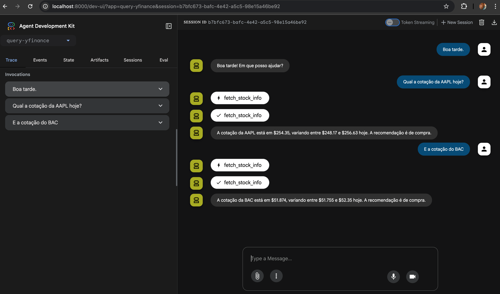

# Google ADK + YFinance – Consulta de Cotações

- Artigo (PT-BR): [docs/artigo.md](docs/artigo.md)
- Article (EN): [docs/article-en.md](docs/article-en.md)
- Usage demo: [docs/usage-demo.md](docs/usage-demo.md)

Este projeto demonstra um agente do Google ADK que consulta cotações de ações usando o YFinance. O agente expõe uma ferramenta `fetch_stock_info` que retorna nome do ativo, preço atual, mínima/máxima do dia e recomendação.

**Visão Geral**
- **Agente:** `query_yfinance_agent` (modelo `gemini-2.0-flash`)
- **Ferramenta:** `fetch_stock_info(ticker_symbol: str)` via `yfinance`
- **Pasta do agente:** `query-yfinance/` (contém `agent.py` e `.env`)

**Pré‑requisitos**
- `Python >= 3.12`
- Chave de API do Google Generative AI: defina `GOOGLE_API_KEY` no `.env`
- Opcional: Vertex AI (defina `GOOGLE_GENAI_USE_VERTEXAI=TRUE` e configure seu projeto/região do GCP)

**Instalação**
- Com `uv` (recomendado):
  - Instale o `uv` (https://docs.astral.sh/uv/)
  - No diretório do projeto: `uv sync`
  - Ative o ambiente: `source .venv/bin/activate`
- Com `pip`:
  - Crie o venv: `python3.12 -m venv .venv && source .venv/bin/activate`
  - Atualize pip: `pip install -U pip`
  - Instale o projeto: `pip install -e .`

**Configuração**
1) Copie o exemplo de variáveis:
   - `cp query-yfinance/.env-sample query-yfinance/.env`
2) Edite `query-yfinance/.env` e preencha:
   - `GOOGLE_API_KEY=...` (obrigatório quando não usa Vertex)
   - `GOOGLE_GENAI_USE_VERTEXAI=FALSE` (ou `TRUE` para usar Vertex)
   - Se usar Vertex, garanta que as credenciais do GCP estejam ativas (por exemplo, `gcloud auth application-default login`) e exporte `GOOGLE_CLOUD_PROJECT` e `GOOGLE_CLOUD_REGION` conforme seu ambiente.

Observação: o ADK carrega o `.env` a partir da pasta do agente; mantenha o arquivo dentro de `query-yfinance/`.

**Como Usar (CLI)**
- Ative o venv e execute:
  - `adk run query-yfinance`
- Interaja no terminal (digite `exit` para sair). Exemplos de perguntas:
  - "Qual o preço atual de PETR4.SA?"
  - "Mostre a mínima e a máxima do dia para AAPL"

O agente utilizará a ferramenta `fetch_stock_info` para consultar o ticker informado via YFinance e retornará um resumo.

**Exemplos de Ticker**
- Brasil (B3): sufixo `.SA` (ex.: `PETR4.SA`, `VALE3.SA`)
- EUA (NASDAQ/NYSE): `AAPL`, `GOOGL`, `MSFT` etc.

**Estrutura do Projeto**
- `query-yfinance/agent.py`: definição do agente e da ferramenta `fetch_stock_info`.
- `query-yfinance/.env-sample`: exemplo de variáveis de ambiente.
- `pyproject.toml`: dependências (`google-adk`, `yfinance`) e metadados do projeto.

**Resolução de Problemas**
- "adk: command not found": garanta que o venv está ativo (o pacote `google-adk` instala o comando `adk`).
- Erros de autenticação do modelo: verifique `GOOGLE_API_KEY` (ou credenciais do GCP ao usar Vertex) no `query-yfinance/.env`.
- Respostas vazias do YFinance: confirme o ticker e conectividade de rede; alguns campos podem não estar disponíveis para todos os ativos.

**Dicas de Desenvolvimento**
- Para ajustar o comportamento do agente, edite `model`, `instruction` ou adicione novas ferramentas em `query-yfinance/agent.py`.
- Para mudar a fonte de dados, crie outra função no mesmo arquivo e adicione-a à lista `tools=[...]` do agente.
