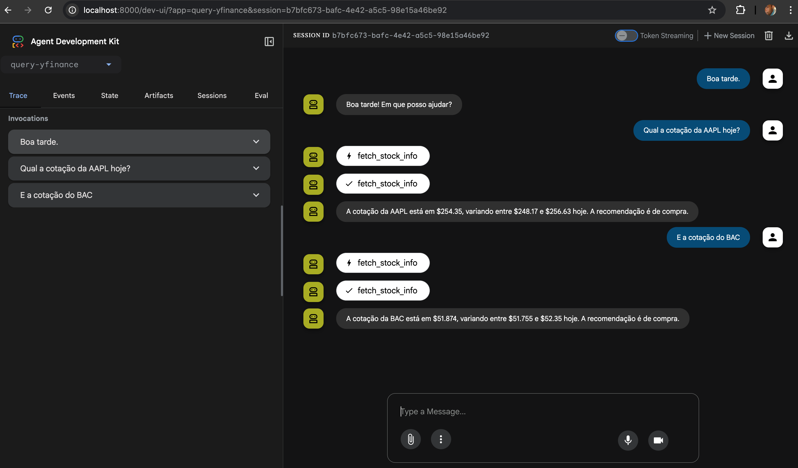

# Google ADK + YFinance in Python: building an agent to query stock quotes

## Abstract
This article presents an agent built with the Google ADK (Agent Development Kit) that retrieves stock quotes via YFinance. The agent exposes a `fetch_stock_info` tool to answer questions about current price, intraday low/high, and analyst recommendation, using a Gemini model. It covers architecture, setup and execution, plus ideas for future enhancements.

## Why this project
- Access stock data conversationally with context.
- Integrate Gemini models with a practical data source (Yahoo Finance via YFinance).
- Demonstrate how to publish Python tools into an agent with Google ADK.

## Architecture
- **Agent**: `query_yfinance_agent` (model `gemini-2.0-flash`), defined in `query-yfinance/agent.py`.
- **Tool**: `fetch_stock_info(ticker_symbol: str)`, using `yfinance` to fetch:
  - `displayName` (or `shortName`)
  - `currentPrice`
  - `dayLow`
  - `dayHigh`
  - `recommendationKey`
- **Orchestration**: Google ADK invokes the model and decides when to call the tool based on the user prompt.
- **Configuration**: variables in `query-yfinance/.env` (loaded automatically by ADK).

## Key code
File `query-yfinance/agent.py`:
- Query tool:
  - Receives `ticker_symbol` (e.g., `PETR4.SA`, `AAPL`).
  - Uses `yfinance.Ticker(...).info` and returns a dictionary of useful fields.
- ADK Agent:
  - Defines `name`, `model`, `description`, and `instruction`.
  - Registers the tool via `tools=[fetch_stock_info]`.

## Prerequisites
- Python `>= 3.12`.
- Google Generative AI API key (for the public API): env var `GOOGLE_API_KEY`.
- Optional: Vertex AI (with `GOOGLE_GENAI_USE_VERTEXAI=TRUE` + GCP credentials).

## Installation
With `uv` (recommended):
1. Install `uv`: https://docs.astral.sh/uv/
2. In the project directory, run `uv sync`.
3. Activate the env: `source .venv/bin/activate`.

With `pip`:
1. Create and activate venv: `python3.12 -m venv .venv && source .venv/bin/activate`
2. Upgrade pip: `pip install -U pip`
3. Install the project: `pip install -e .`

Main dependencies are in `pyproject.toml`: `google-adk` and `yfinance`.

## Configuration
1. Copy the env sample: `cp query-yfinance/.env-sample query-yfinance/.env`
2. Edit `query-yfinance/.env`:
   - `GOOGLE_API_KEY=...` (when not using Vertex)
   - `GOOGLE_GENAI_USE_VERTEXAI=FALSE` (or `TRUE` + `gcloud auth application-default login` + export `GOOGLE_CLOUD_PROJECT` and `GOOGLE_CLOUD_REGION`)

Note: ADK reads the `.env` from the agent folder; keep it in `query-yfinance/`.

## Running (CLI)
1. Activate the venv.
2. Run `adk run query-yfinance`.
3. Example questions:
   - “What is the current price of `PETR4.SA`?”
   - “Show the intraday low and high for `AAPL`.”

Ticker examples:
- Brazil (B3): `PETR4.SA`, `VALE3.SA` (note the `.SA` suffix).
- US: `AAPL`, `GOOGL`, `MSFT`.

## Runtime flow
1. You converse with the agent in the terminal.
2. The Gemini model interprets the intent and decides to call `fetch_stock_info` with the ticker.
3. The tool uses YFinance and returns the fields.
4. The agent composes a natural response with the returned data.

## Error handling and limitations
- **Invalid ticker**: YFinance may return incomplete data; the agent still answers with the provided name/ticker.
- **Missing fields**: not all assets have `currentPrice`/`recommendationKey`; the code handles empty dicts.
- **Network/rate limits**: YFinance depends on Yahoo Finance and may temporarily fail; try again.
- **Accuracy/latency**: third-party data can be delayed; validate before financial decisions.

## Suggested enhancements
- **Formatting**: include currency, intraday change, and last price timestamp.
- **Validation**: auto-suggest the `.SA` suffix for Brazilian tickers.
- **Caching**: short TTL to reduce repeated YFinance calls.
- **Multi-tool**: add history (`history`) and analytics (moving averages, volatility).
- **Observability**: structured logs and per-ticker call metrics.
- **i18n**: PT/EN responses based on user preference.

## Repository structure
- `query-yfinance/agent.py`: agent and `fetch_stock_info` tool.
- `query-yfinance/.env-sample`: env variable template.
- `README.md`: quickstart.
- `pyproject.toml`: metadata and dependencies.

## Conclusion
With a few lines of code and Google ADK, we integrate a Gemini model with a practical financial data source (YFinance), creating a conversational agent that answers market queries. The approach is extensible: add tools to enrich analysis, history, and report formatting.
